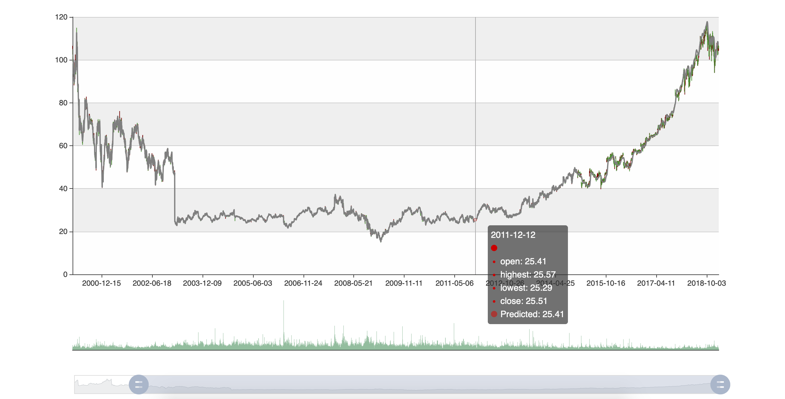
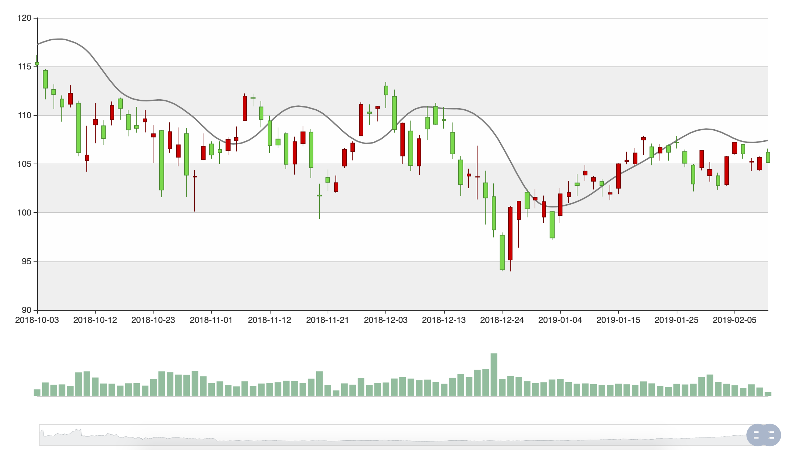

## Project name: Stockive

### Team members:
- Ruochi Zhang
- Haomin Xie
- Yunshu Liang

### The problem chosen:
Stock prediction system

### Context:

The record of stock price is a time series, which reflects
the performance of a corporate. Although there are a lot of complicated
theoretical financial features to evaluate the stock price, it is still
difficult to predict the price technically. However, as the deep
learning technology is getting advanced, the opportunity to gain a
steady fortune from the stock market is amplifying. And we want to
design a good algorithm which is based on deep learning method to
predict the stock price and help the investors to gain steady profits.
Moreover, we aim to apply our algorithm into a practical system that can
be used in real investment environment, which is of great importance to
help in maximizing the profit of stock option purchase while keeping the
risk low.

### Approach:

We use stock price data from AMD and GOOGLE to train the
model in order to achieve a more comprehensive algorithm. To achieve
this, we choose fifty days as a window size and one day as a predict
size. The goal is to integrate the information of fifty days' stock
prices to predict the next day's. From the original dataset, we split
20% as testing dataset and 80% as training dataset. The algorithm we use
here is Recurrent Neural Networks(RNN). More specifically, it is Long
Short Term Memory networks(LSTMs), a special kind of RNN, capable of
learning long-term dependencies, from which we can capture the long time
trend of the stock price.

### Data: Historical AMD and GOOGLE Stock Price since 2009, Real time stock price from Alpha Vantage APIs

- We firstly applied these two datasets as the train and test data to modify the model. According to the performance, by adjusting the parameters and feature selection, a better model will be delivered based on test data and everyday prediction.

1. AMD.csv
2. GOOGLE.csv

  **Field**|   **Data Type** |  **Description**
  |---:|---:|---:|
  Date     |   date time     |  The date of the stock price
  Open     |  float          | The price when market just opened
  High     |   float         |  The highest price in the day
  Low      |   float         |  The lowest price in the day
  Close    |   float         |  The price when market is closed
  Volume   |   int           |  The trading volume of the market

Source files link:
[https://www.kaggle.com/gunhee/amdgoogle](https://www.kaggle.com/gunhee/amdgoogle)

- To follow up, we aim to apply real time stock data into the system **using Alpha Vantage APIs** which provide realtime and historical global equity data in 4 different temporal resolutions: (1) daily, (2) weekly, (3) monthly, and (4) intraday. Daily, weekly, and monthly time series contain 20+ years of historical data. By applying the API, it can return a JSON file containing the real time stock information. Based on the four resolutions, we are able to retrieve the data details as
requirements.

**eg. (preview of intraday data)**

*{\
\"Meta Data\": {\
\"1. Information\": \"Intraday (5min) open, high, low, close prices and
volume\",\
\"2. Symbol\": \"MSFT\",\
\"3. Last Refreshed\": \"2019-02-11 10:40:00\",\
\"4. Interval\": \"5min\",\
\"5. Output Size\": \"Compact\",\
\"6. Time Zone\": \"US/Eastern\"\
},\
\"Time Series (5min)\": {\
\"2019-02-11 10:40:00\": {\
\"1. open\": \"105.7400\",\
\"2. high\": \"105.8200\",\
\"3. low\": \"105.7100\",\
\"4. close\": \"105.7300\",\
\"5. volume\": \"161340\"\
},\
\"2019-02-11 10:35:00\": {\
\"1. open\": \"105.5900\",\
\"2. high\": \"105.7400\",\
\"3. low\": \"105.4600\",\
\"4. close\": \"105.7350\",\
\"5. volume\": \"192407\"\
}*

> *}*
*}*

### System screenshot
-
-